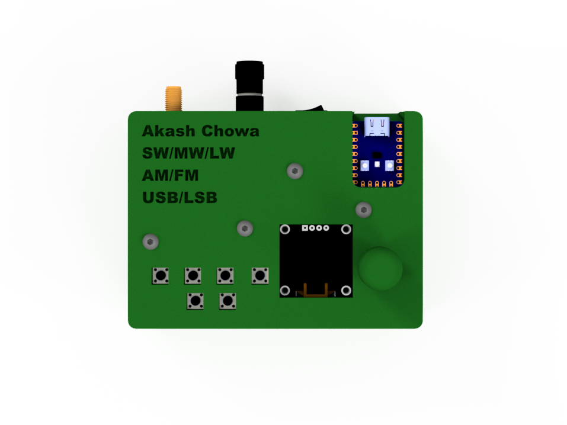
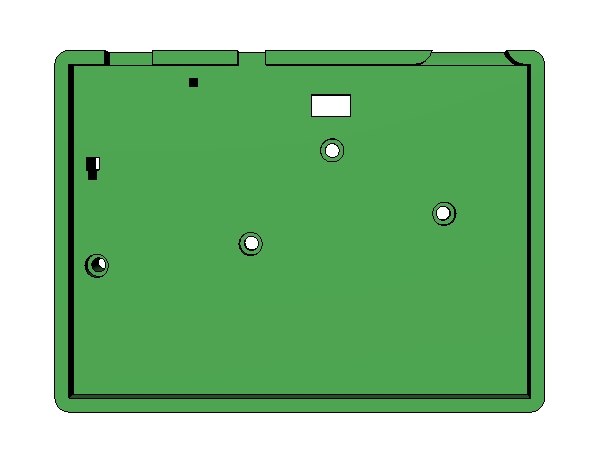
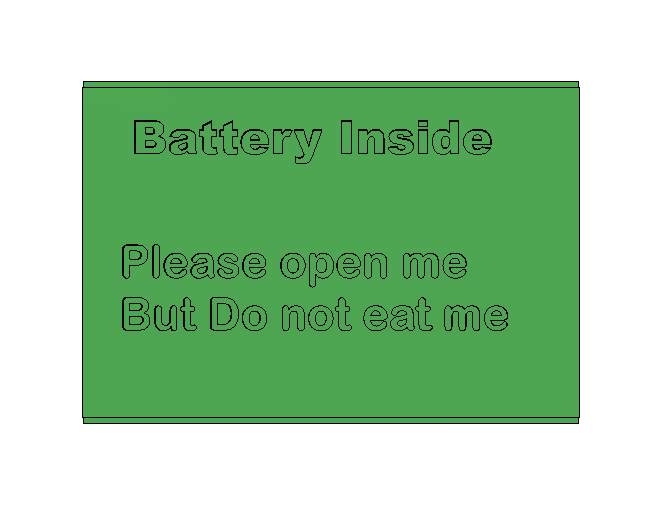
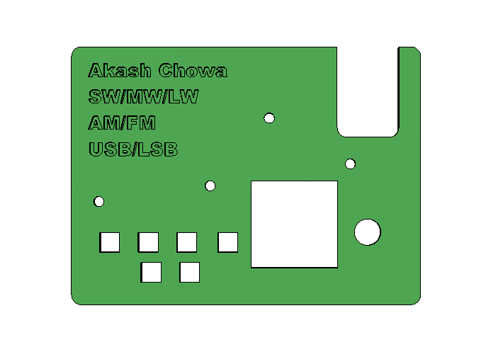
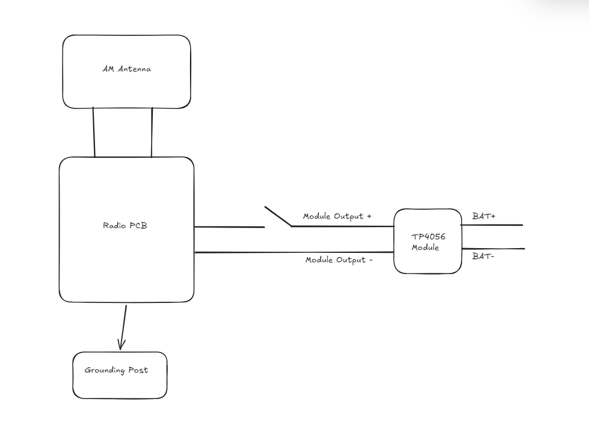
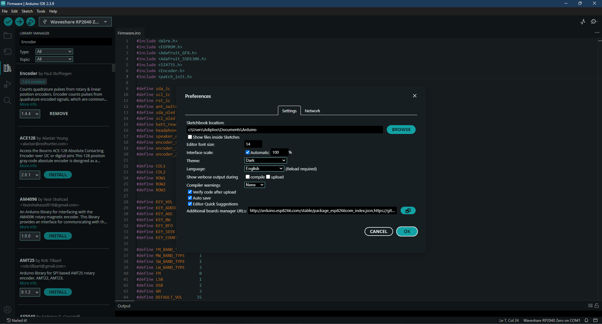
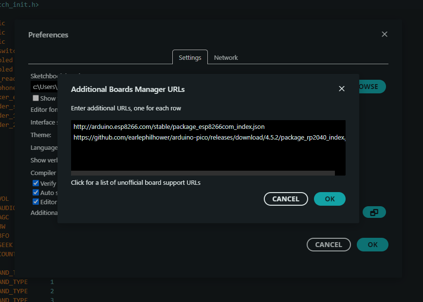
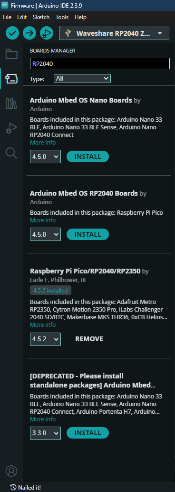
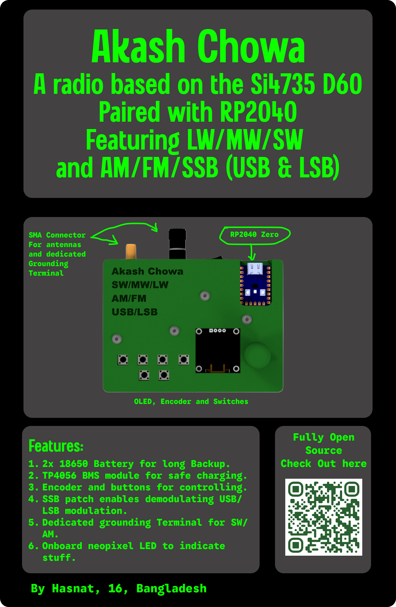

# Akash Chowa DX

Akash Chowa DX is a SW/MW/LW receiver designed based on the Si4735 Radio receiver IC paired with the RP2040 Zero Dev board.

# Why did I build it?

I had an affection towards Radios from childhood. I sometimes try to receive SW stations on my 5$ budget radio I had gotten from a local store. But It does not work that efficiently and I needed a better receiver.
Also the radio I currently have can not demodulate SSB (Single Sideband) and RDS transmitted by modern FM stations. So I designed it to fulfill my own requirements. It also helped me learn new things like impedance control.

# Gallery

Here are some pictures of what I designed

# Schematic


# PCB


# CAD



Base of the case



battery cover



top cover



# BOM 

| Item                                             | Quantity | Price          | Link |
|--------------------------------------------------|----------|----------------|------|
| Waveshare RP2040 Zero                          | 1        | $5.86          | [Link](https://www.aliexpress.com/item/1005009026492881.html) |
| 1N5819 Diode                                     | 100      | $5.49          | [Link](https://www.aliexpress.com/item/1005010374297754.html) |
| 1N4148 Diode                                     | 100      | $4.43          | [Link](https://www.aliexpress.com/item/1005010373909049.html) |
| SSD1306 OLED Display                             | 1        | $5.33           | [Link](https://www.aliexpress.com/item/1005006141235306.html) |
| EC 11 Encoder with Push Button Half Handle 20MM Shaft | 5 | $6.31 | [Link](https://www.aliexpress.com/item/1005005983134515.html) |
| Si4735 D60 GU | 1 | $8.06  | [Link](https://www.aliexpress.com/item/1005012026178499.html)|
| PE4259 | 20 | $4.96  | [Link](https://www.aliexpress.com/item/32860670352.html)|
| 32.768 kHz Crystal SMD | 10 | $5.01  | [Link](https://www.aliexpress.com/item/1005007548931959.html)|
| 2.5K Ferrite Bead | 100 | $1.63  | [Link](https://www.aliexpress.com/item/1005009841998170.html)|
| 1K Ferrite Bead | 100 | $1.70  | [Link](https://www.aliexpress.com/item/1005009841998170.html)|
| 100uF, 10uF, 100nF, 22pF, 1uF, 0.47uF, 33pF, 18pF, 22nF Capacitor Pack | 720 | $6.21  | [Link](https://www.aliexpress.com/item/1005006124283234.html)|
| 100 ohm Resistor 1206 | 100 | $1.61  | [Link](https://www.aliexpress.com/item/1005011924690352.html)|
| 20k ohm Resistor 1206 | 100 | $1.61  | [Link](https://www.aliexpress.com/item/1005011924690352.html)|
| 100k ohm Resistor 1206 | 100 | $1.61  | [Link](https://www.aliexpress.com/item/1005011924690352.html)|
| SMA connector Edge Mount | 5 | $5.32  | [Link](https://www.aliexpress.com/item/1005007424915378.html)|
| 180nH Inductor 0603 | 100 | $1.33  | [Link](https://www.aliexpress.com/item/1005004900337516.html)|
| 4.7uH Inductor 0603 | 100 | $1.33  | [Link](https://www.aliexpress.com/item/1005004900337516.html)|
| Tactile Switches Push buttons | 20 | $4.12  | [Link](https://www.aliexpress.com/item/1005006046180384.html)|
| PRTR5V0U2X ESD protection Diode | 10 | $4.66  | [Link](https://www.aliexpress.com/item/4000580941007.html) |
| TPA6132A2RTE Headphone Amplifier | 5 | $3.35 | [Link](https://www.aliexpress.com/item/1005006173782133.html) |
| 18650 Lithium Battery | 2 | BDT 510 (~$4.16)  | [Link](https://store.roboticsbd.com/battery-charger/983-18650-generic-37v-li-ion-battery-standard-quality-flat-top-solderable-robotics-bangladesh.html)|
| TP4056 BMS | 1 | $4.02 | [Link](https://www.aliexpress.com/item/1005009635476640.html)|
| Rocker Switch | 5 | $5.20  | [Link](https://www.aliexpress.com/item/1005008778176373.html)|
| Binding Post | 5 | $6.00 | [Link](https://www.aliexpress.com/item/1005008274414247.html)|
| Headphone Connector | 10 | $4.45   | [Link](https://www.aliexpress.com/item/32871877936.html)|
| AM ferrite Antenna | 2 | $10.04   | [Link](https://www.aliexpress.com/item/1005011550262545.html)|
| Whip SMA Antenna | 1 | $8.93   | [Link](https://www.aliexpress.com/item/1005010114425808.html)|
| M3 Heat Set Inserts | 30 | $6.13 | [Link](https://www.aliexpress.com/item/1005006071488810.html) |
| M3 Fasteners | 50 | $6.28 | [Link](https://www.aliexpress.com/item/1005011845940916.html) |
| Top Case      | 1 | Printing Legion | [Link](https://printlegion.hackclub.com/) |
| Bottom Case   | 1 | Printing Legion | [Link](https://printlegion.hackclub.com/) |
| Battery Cover | 1 | Printing Legion | [Link](https://printlegion.hackclub.com/) |
| PCB           | 5 | $6.24           | [Link](https://jlcpcb.com/) |

# How to Build

For impedance control, while ordering from JLCPCB, select the JLC04161H-7628 layer stackup. Also better to import this to the Easyeda Pro and then order as that can get you a few extra discounts.


For ordering parts, you can find most components in LCSC but some components may not be available in LCSC so it needs to be bought from 3rd party stores like aliexpress/alibaba.

For the AM antenna its better to source it from an old broken radio, as its hard to find ferrite antennas online and those tend to be very expensive.

Also buy parts like the TP4056, binding post and 18650 batteries locally as on aliexpress they tend to be a lot more expensive.

Batteries need to be connected in parralel as the tp4056 is a 1S BMS.

Connect the switch in series to the TP4056 output's positive terminal and the PCB's positive power input. PCB's negative and TP4056's negative also needs to be connected.

It should look something like this



# Antenna/Grounding Suggestion

You can use a 9:1 balun to connect a longwire antenna to the SMA connector.

For grounding you may be able to just lay the wire parallel to the ground for a few meters.


# Flashing the firmware

To flash the firmware, you first need to add the board to your arduino IDE.

After getting into the Arduino IDE, Go to Preference


Now click on the additional board manager URL and add ```https://github.com/earlephilhower/arduino-pico/releases/download/4.5.2/package_rp2040_index.json```


Now go to boards manager and search RP2040 and download this library


Now you can select the MCU as the waveshare RP2040 zero.

After that you need a few libraries
Si4735 library
Adafruit SSD1306 library
Adafruit GFX library
and the Rotary Encoder Library by Paul Stoffregen

Then you can flash the firmware.

For more details on the Si4735 follow the directions in [Si4735 Arduino Library](https://pu2clr.github.io/SI4735/) here.


# Zine 


